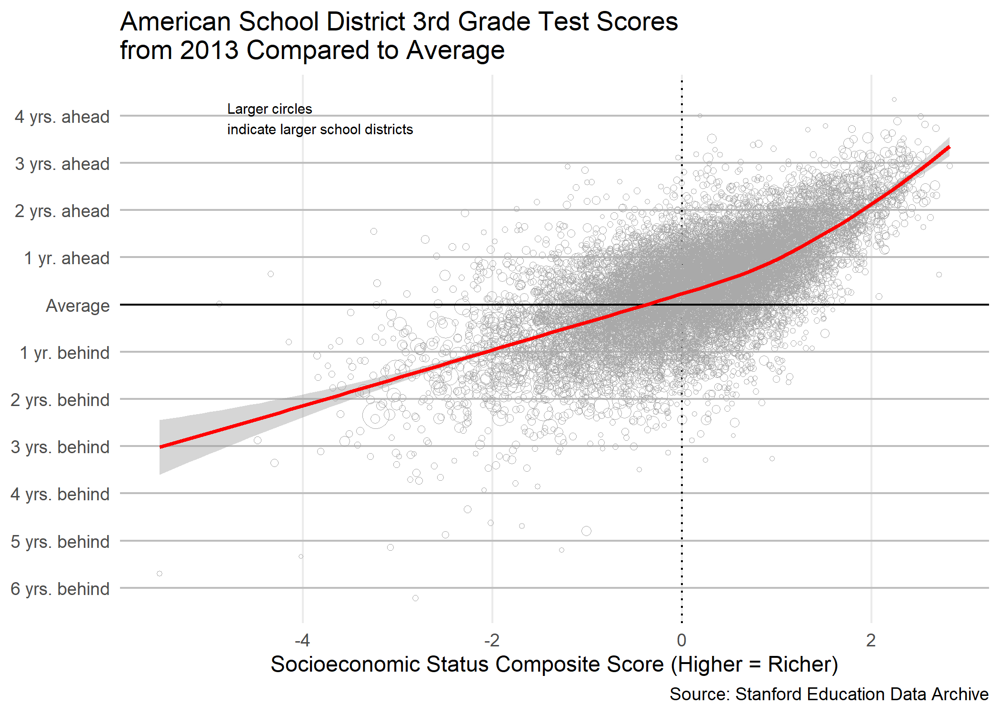
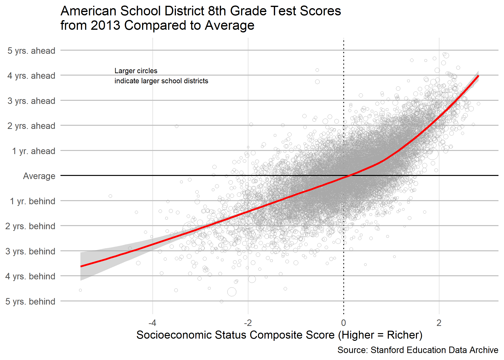
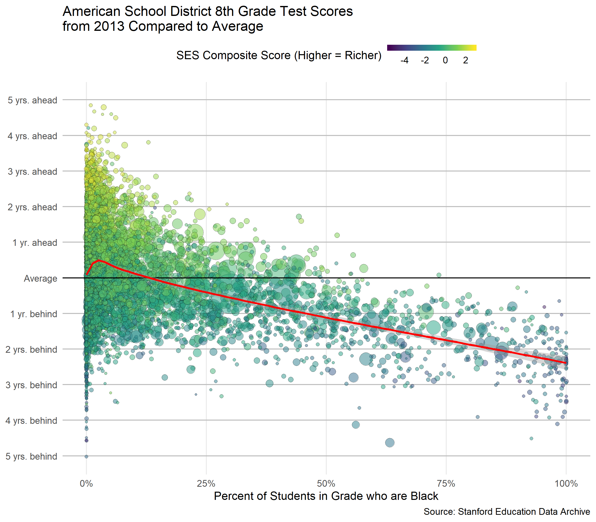
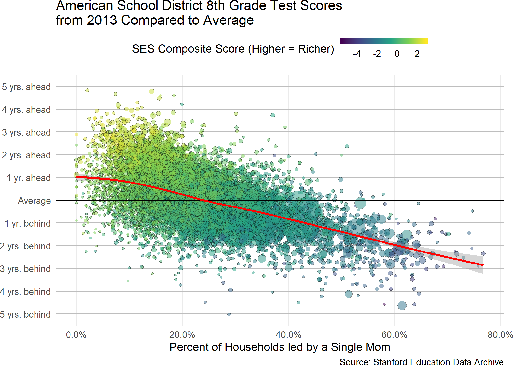
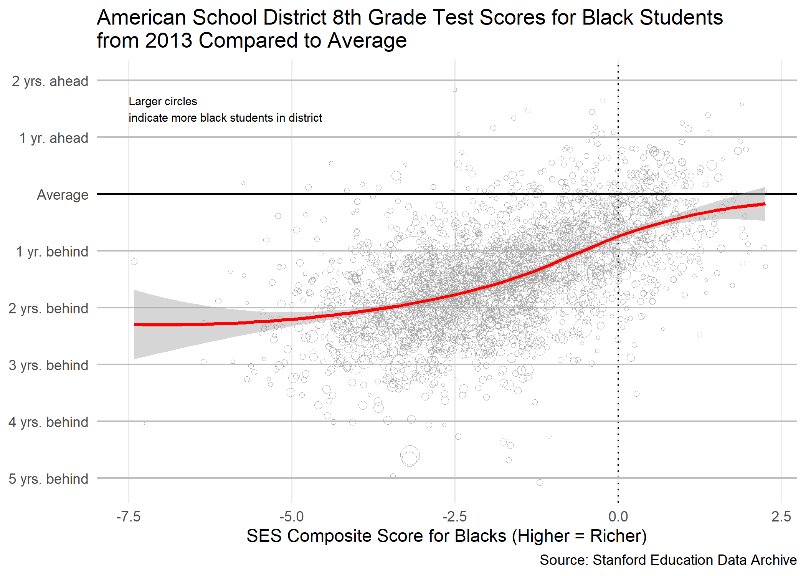
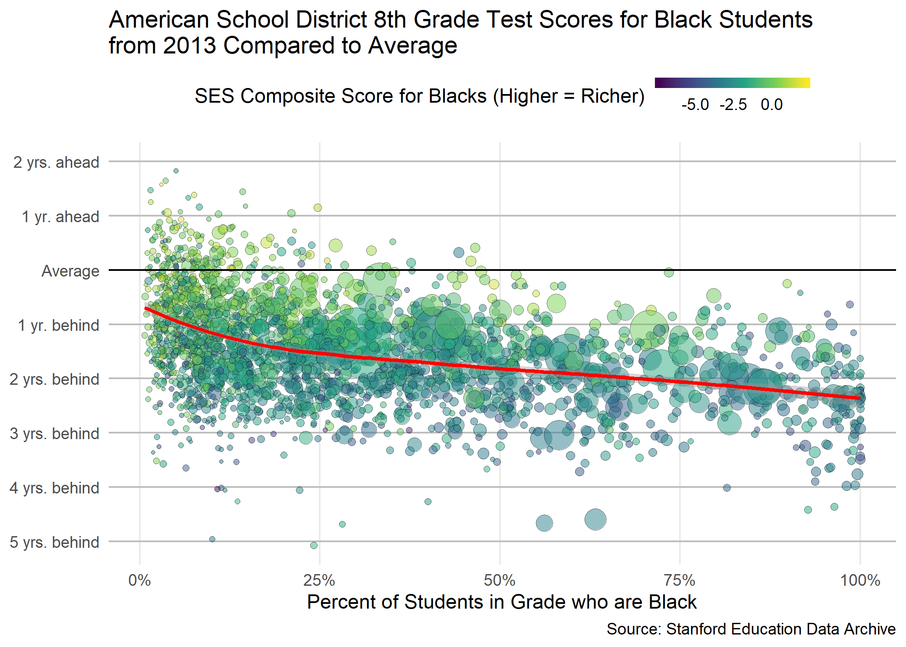
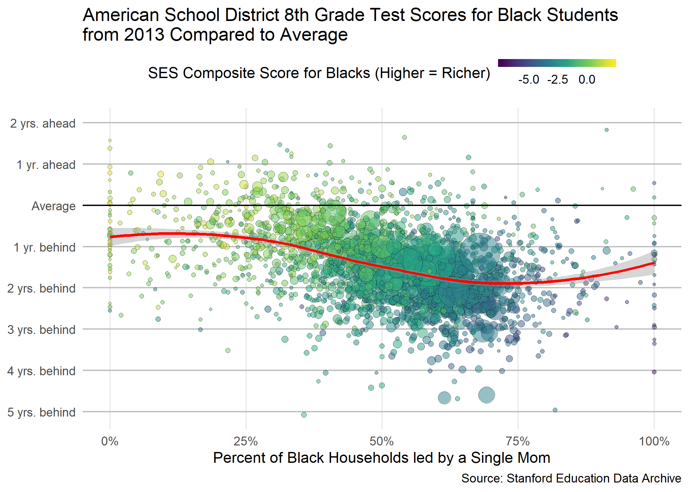
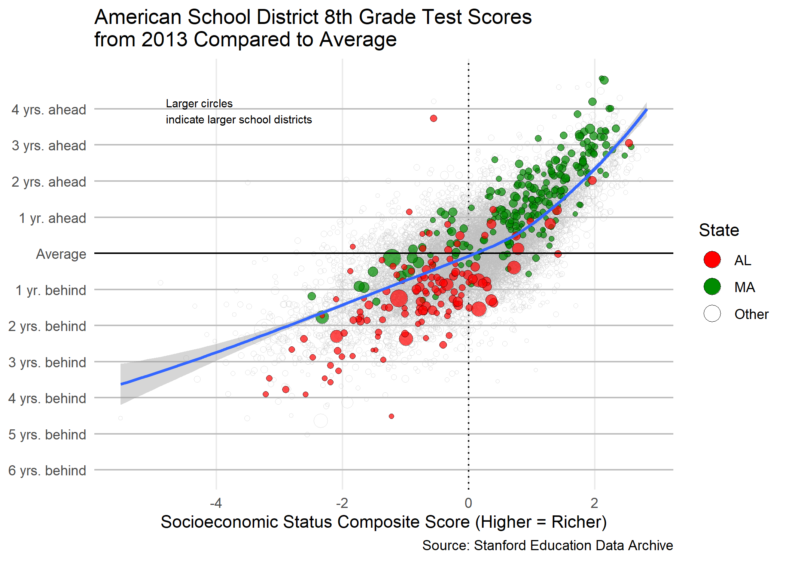
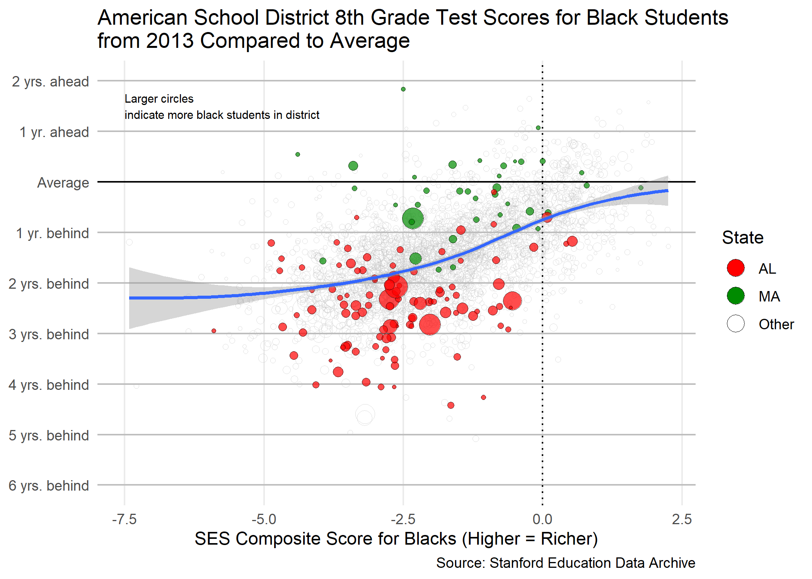
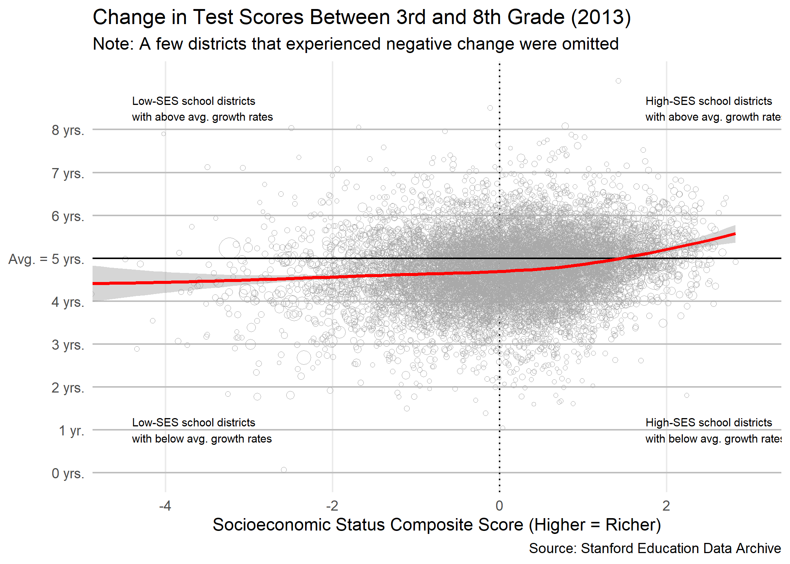

Final report
================
Michelle Huang
2019-03-14

-   [Introduction](#introduction)
-   [What can be done?](#what-can-be-done)
-   [Conclusion](#conclusion)

``` r
# Libraries
library(tidyverse)
library(plotly)

# Parameters
  # Data filepaths
pooled_data_fp <- "../../c01data/Reardon/reardon_data_semipooled.csv"
change_data_fp <- "../../c01data/Reardon/reardon_data_change.csv"

# Helper Functions
y_lab_fn <- function(yval) {
  case_when(
    yval < -1 ~ str_c(-1 * yval, " yrs. behind"),
    yval == -1 ~ "1 yr. behind",
    yval == 0 ~ "Average",
    yval == 1 ~ "1 yr. ahead",
    yval > 1 ~ str_c(yval, " yrs. ahead")
  )
}

y_lab_fn_change <- function(yval) {
  case_when(
    yval == 5 ~ "Avg. = 5 yrs.",
    yval == 1 ~ "1 yr.",
    TRUE ~ str_c(yval, " yrs.")
  )
}
```

``` r
scores_data <-
  read_csv(pooled_data_fp)
```

    ## Parsed with column specification:
    ## cols(
    ##   .default = col_double(),
    ##   leaidC = col_character(),
    ##   leaname = col_character(),
    ##   stateabb = col_character()
    ## )

    ## See spec(...) for full column specifications.

``` r
change_data <-
  read_csv(change_data_fp)
```

    ## Parsed with column specification:
    ## cols(
    ##   .default = col_double(),
    ##   leaidC = col_character(),
    ##   leaname = col_character(),
    ##   stateabb = col_character()
    ## )
    ## See spec(...) for full column specifications.

Introduction
------------

In the United States, we believe in the American Dream -- the idea that everyone in America, regardless of where they were born and what socioeconomic class they were born into, can move up the socioeconomic ladder through hard work.

Education is supposed to be the "great equalizer" that helps make the American Dream achievable, but a quick look at data from the [Stanford Education Data Archive](https://cepa.stanford.edu/seda/overview) (which uses 3rd to 8th grade standardized test scores as a proxy for early and mid-childhood educational opportunity) shows us that educational opportunity around America is anything but equal. Rather, it is heavily influenced by factors like race and parental income.

``` r
scores_data %>%
  filter(year == 2013, grade == 3) %>%
  drop_na(sesall, mn_all, totgyb_all) %>%
  sample_frac() %>%
  ggplot(aes(x = sesall, y = mn_all - 3)) +
  geom_hline(yintercept = -6:4, color = "grey") +
  geom_vline(xintercept = 0, color = "black", linetype = "dotted") +
  geom_point(
    aes(size = totgyb_all), 
    shape = 21, 
    color = "darkgrey", 
    stroke = 0.25
  ) +
  geom_hline(yintercept = 0, color = "black") +
  geom_smooth(method = loess, color = "red") +
  annotate(
    geom = "text",
    label = "Larger circles\nindicate larger school districts",
    x = -4.8, 
    y = 3.95,
    size = 2.5,
    hjust = 0
  ) + 
  scale_size(range = c(1, 18), guide = FALSE) +
  scale_y_continuous(breaks = -6:4, labels = y_lab_fn, minor_breaks = NULL) +
  theme_minimal() +
  theme(panel.grid.minor.x = element_blank(), axis.title.y = element_blank()) +
  labs(
    title = "American School District 3rd Grade Test Scores\nfrom 2013 Compared to Average",
    x = "Socioeconomic Status Composite Score (Higher = Richer)",
    caption = "Source: Stanford Education Data Archive"
  )
```



``` r
scores_data %>%
  filter(year == 2013, grade == 8) %>%
  drop_na(sesall, mn_all, totgyb_all) %>%
  sample_frac() %>%
  ggplot(aes(x = sesall, y = mn_all - 8)) +
  geom_hline(yintercept = -5:5, color = "grey") +
  geom_vline(xintercept = 0, color = "black", linetype = "dotted") +
  geom_point(
    aes(size = totgyb_all), 
    shape = 21, 
    color = "darkgrey",
    stroke = 0.25
  ) +
  geom_hline(yintercept = 0, color = "black") +
  geom_smooth(method = loess, color = "red") +
  annotate(
    geom = "text",
    label = "Larger circles\nindicate larger school districts",
    x = -4.8, 
    y = 4,
    size = 2.5,
    hjust = 0
  ) + 
  scale_size(range = c(1, 18), guide = FALSE) +
  scale_y_continuous(breaks = -5:5, labels = y_lab_fn, minor_breaks = NULL) +
  theme_minimal() +
  theme(panel.grid.minor.x = element_blank(), axis.title.y = element_blank()) +
  labs(
    title = "American School District 8th Grade Test Scores\nfrom 2013 Compared to Average",
    x = "Socioeconomic Status Composite Score (Higher = Richer)",
    caption = "Source: Stanford Education Data Archive"
  )
```



In these plots, we can see the strong positive correlation between a school district's early and mid-education test scores and socioeconomic status (SES). Some poor school districts are over 4 years behind the average score for a given grade level, which is really disheartening. This relationship remains consistent from 2009 to 2013, and it is present in the test scores for all grade levels from 3 to 8. For 2013, it actually looks like SES had a greater impact on 8th grade test scores compared to 3rd grade scores, with low-SES districts scoring worse compared to average in 8th grade compared to in 3rd grade. Given the well-known [positive relationship between SAT scores](https://economix.blogs.nytimes.com/2009/08/27/sat-scores-and-family-income/) and family income, it's reasonable to believe that the trend we observe here is not limited to elementary and middle school test scores.

``` r
scores_data %>%
  filter(year == 2013, grade == 8) %>%
  drop_na(perblk, sesall, mn_all, totgyb_all) %>%
  sample_frac() %>%
  ggplot(aes(x = perblk, y = mn_all - 8)) +
  geom_hline(yintercept = -5:5, color = "grey") +
  geom_point(
    aes(size = totgyb_all, fill = sesall), 
    shape = 21, 
    stroke = 0.25,
    alpha = 0.5
  ) +
  geom_hline(yintercept = 0, color = "black") +
  geom_smooth(method = loess, color = "red") +
  scale_size(range = c(1, 18), guide = FALSE) +
  scale_fill_viridis_c() +
  scale_x_continuous(labels = scales::percent) +
  scale_y_continuous(breaks = -5:5, labels = y_lab_fn, minor_breaks = NULL) +
  guides(
    fill = 
      guide_colorbar(
        barwidth = 6,
        barheight = 0.4,
        ticks = FALSE,
        direction = "horizontal"
      )
  ) +
  theme_minimal() +
  theme(
    panel.grid.minor.x = element_blank(), 
    axis.title.y = element_blank(), 
    legend.position = "top"
  ) +
  labs(
    title = "American School District 8th Grade Test Scores\nfrom 2013 Compared to Average",
    fill = "SES Composite Score (Higher = Richer)",
    x = "Percent of Students in Grade who are Black",
    caption = "Source: Stanford Education Data Archive"
  )
```



We also see that there's a negative correlation between a school district's test scores and the % of their students who are black. This relationship, again, remains consistent from 2009 to 2013, and is present in the test scores for all grade levels from 3 to 8. In this case, socioeconomic status explains a large part of the correlation, but I think the strong relationship between socioeconomic status and percent black speaks to another concerning inequality present in American society.

``` r
scores_data %>%
  filter(year == 2013, grade == 8) %>%
  drop_na(singmom_all, sesall, mn_all, totgyb_all) %>%
  sample_frac() %>%
  ggplot(aes(x = singmom_all, y = mn_all - 8)) +
  geom_hline(yintercept = -5:5, color = "grey") +
  geom_point(
    aes(size = totgyb_all, fill = sesall), 
    shape = 21, 
    stroke = 0.25,
    alpha = 0.5
  ) +
  geom_hline(yintercept = 0, color = "black") +
  geom_smooth(method = loess, color = "red") +
  scale_size(range = c(1, 18), guide = FALSE) +
  scale_fill_viridis_c() +
  scale_x_continuous(labels = scales::percent) +
  scale_y_continuous(breaks = -5:5, labels = y_lab_fn, minor_breaks = NULL) +
  guides(
    fill = 
      guide_colorbar(
        barwidth = 6,
        barheight = 0.4,
        ticks = FALSE,
        direction = "horizontal"
      )
  ) +
  theme_minimal() +
  theme(
    panel.grid.minor.x = element_blank(), 
    axis.title.y = element_blank(), 
    plot.margin = margin(r = 10),
    legend.position = "top"
  ) +
  labs(
    title = "American School District 8th Grade Test Scores\nfrom 2013 Compared to Average",
    fill = "SES Composite Score (Higher = Richer)",
    x = "Percent of Households led by a Single Mom",
    caption = "Source: Stanford Education Data Archive"
  )
```



Perhaps unsurprisingly, school districts with a high percentage of households headed by single moms also tend to be poorer and test worse. This trend is similar to the percent black trend.

The following plots focus on the scores of black students, and we see something very striking: even black students in wealthy school districts tend to do below average.

``` r
scores_data %>%
  filter(year == 2013, grade == 8) %>%
  drop_na(sesblk, mn_blk, totgyb_blk) %>%
  sample_frac() %>%
  ggplot(aes(x = sesblk, y = mn_blk - 8)) +
  geom_vline(xintercept = 0, color = "black", linetype = "dotted") +
  geom_hline(yintercept = -5:2, color = "grey") +
  geom_point(
    aes(size = totgyb_blk), 
    shape = 21, 
    stroke = 0.25,
    color = "darkgrey"
  ) +
  annotate(
    geom = "text",
    label = "Larger circles\nindicate more black students in district",
    x = -7.5, 
    y = 1.5,
    size = 2.5,
    hjust = 0
  ) + 
  geom_hline(yintercept = 0, color = "black") +
  geom_smooth(method = loess, color = "red") +
  scale_size(range = c(1, 18), guide = FALSE) +
  scale_y_continuous(breaks = -5:2, labels = y_lab_fn, minor_breaks = NULL) +
  theme_minimal() +
  theme(
    panel.grid.minor.x = element_blank(), 
    axis.title.y = element_blank(), 
    legend.position = "top"
  ) +
  labs(
    title = "American School District 8th Grade Test Scores for Black Students\nfrom 2013 Compared to Average",
    x = "SES Composite Score for Blacks (Higher = Richer)",
    caption = "Source: Stanford Education Data Archive"
  )
```



``` r
scores_data %>%
  filter(year == 2013, grade == 8) %>%
  drop_na(perblk, sesblk, mn_blk, totgyb_blk) %>%
  sample_frac() %>%
  ggplot(aes(x = perblk, y = mn_blk - 8)) +
  geom_hline(yintercept = -5:2, color = "grey") +
  geom_point(
    aes(size = totgyb_blk, fill = sesblk), 
    shape = 21, 
    stroke = 0.25,
    alpha = 0.5
  ) +
  geom_hline(yintercept = 0, color = "black") +
  geom_smooth(method = loess, color = "red") +
  scale_size(range = c(1, 18), guide = FALSE) +
  scale_fill_viridis_c() +
  scale_x_continuous(labels = scales::percent) +
  scale_y_continuous(breaks = -5:2, labels = y_lab_fn, minor_breaks = NULL) +
  guides(
    fill = 
      guide_colorbar(
        barwidth = 6,
        barheight = 0.4,
        ticks = FALSE,
        direction = "horizontal"
      )
  ) +
  theme_minimal() +
  theme(
    panel.grid.minor.x = element_blank(), 
    axis.title.y = element_blank(), 
    legend.position = "top"
  ) +
  labs(
    title = "American School District 8th Grade Test Scores for Black Students\nfrom 2013 Compared to Average",
    fill = "SES Composite Score for Blacks (Higher = Richer)",
    x = "Percent of Students in Grade who are Black",
    caption = "Source: Stanford Education Data Archive"
  )
```



``` r
scores_data %>%
  filter(year == 2013, grade == 8) %>%
  drop_na(singmom_blk, sesblk, mn_blk, totgyb_blk) %>%
  sample_frac() %>%
  ggplot(aes(x = singmom_blk, y = mn_blk - 8)) +
  geom_hline(yintercept = -5:2, color = "grey") +
  geom_point(
    aes(size = totgyb_blk, fill = sesblk), 
    shape = 21, 
    stroke = 0.25,
    alpha = 0.5
  ) +
  geom_hline(yintercept = 0, color = "black") +
  geom_smooth(method = loess, color = "red") +
  scale_size(range = c(1, 18), guide = FALSE) +
  scale_fill_viridis_c() +
  scale_x_continuous(labels = scales::percent) +
  scale_y_continuous(breaks = -5:2, labels = y_lab_fn, minor_breaks = NULL) +
  guides(
    fill = 
      guide_colorbar(
        barwidth = 6,
        barheight = 0.4,
        ticks = FALSE,
        direction = "horizontal"
      )
  ) +
  theme_minimal() +
  theme(
    panel.grid.minor.x = element_blank(), 
    axis.title.y = element_blank(), 
    legend.position = "top"
  ) +
  labs(
    title = "American School District 8th Grade Test Scores for Black Students\nfrom 2013 Compared to Average",
    fill = "SES Composite Score for Blacks (Higher = Richer)",
    x = "Percent of Black Households led by a Single Mom",
    caption = "Source: Stanford Education Data Archive"
  )
```



Here, it looks like although the % of black households led by a single mom has some influence on scores, the relationship is weaker compared to the one present in the plot for all student scores. It's notable how there are so many school districts with a high percent of black households led by a single mom, including a few at 100%.

Although test scores are an imperfect measure of educational opportunity, the correlations highlighted in the plots above clearly indicate that education in America is not a great equalizer. After eight years in school (nine if we count kindergarten), academic achievement is still heavily influenced by racial background and the socioeconomic makeup of a school district, making it difficult for kids born to disadvantaged backgrounds to progress without overcoming significant obstacles. And unfortunately, even if, say, a poor kid manages to beat the odds and make it to a good college, they are still less likely to be prepared for college classes and also less likely to graduate on-time compared to their wealthier peers.

What can be done?
-----------------

The plots above are undoubtedly discouraging for students from disadvantaged backgrounds who are banking on education to help them achieve the American Dream, but there is one important takeaway that becomes evident once we take a closer look at the data: not all poor school districts are equally poor, and we may be able to improve the overall quality of our school districts by investigating the low-SES districts that are performing above average for their socioeconomic status.

``` r
scores_data %>%
  mutate(
    stateabb = 
      if_else(stateabb %in% c("AL", "MA"), stateabb, "Other") %>%
      fct_relevel("AL", "MA")
  ) %>%
  filter(year == 2013, grade == 8) %>%
  drop_na(sesall, mn_all, totgyb_all) %>%
  arrange(desc(stateabb)) %>%
  ggplot(aes(x = sesall, y = mn_all - 8)) +
  geom_hline(yintercept = -6:4, color = "grey") +
  geom_vline(xintercept = 0, color = "black", linetype = "dotted") +
  geom_point(
    aes(
      size = totgyb_all, 
      fill = stateabb, 
      alpha = stateabb %in% c("MA", "AL"),
      color = stateabb %in% c("MA", "AL")
    ), 
    shape = 21, 
    stroke = 0.25
  ) +
  geom_hline(yintercept = 0, color = "black") +
  geom_smooth(method = loess) +
  annotate(
    geom = "text",
    label = "Larger circles\nindicate larger school districts",
    x = -4.8, 
    y = 3.95,
    size = 2.5,
    hjust = 0
  ) + 
  scale_size(range = c(1, 18), guide = FALSE) +
  scale_alpha_manual(values = c("TRUE" = 0.7, "FALSE" = 0.5), guide = FALSE) +
  scale_color_manual(
    values = c("TRUE" = "black", "FALSE" = "grey"), 
    guide = FALSE
  ) + 
  scale_fill_manual(
    values = c("Other" = NA, "AL" = "red", "MA" = "green4")
  ) + 
  scale_y_continuous(breaks = -6:4, labels = y_lab_fn, minor_breaks = NULL) +
  guides(fill = guide_legend(override.aes = list(size = 5))) + 
  theme_minimal() +
  theme(panel.grid.minor.x = element_blank(), axis.title.y = element_blank()) +
  labs(
    title = "American School District 8th Grade Test Scores\nfrom 2013 Compared to Average",
    fill = "State",
    x = "Socioeconomic Status Composite Score (Higher = Richer)",
    caption = "Source: Stanford Education Data Archive"
  )
```



In this plot, we can see that while there are some outlier districts, poor districts in Massachusetts tend to do better than most similarly-poor districts in Alabama.

``` r
scores_data %>%
  mutate(
    stateabb = 
      if_else(stateabb %in% c("AL", "MA"), stateabb, "Other") %>%
      fct_relevel("AL", "MA")
  ) %>%
  filter(year == 2013, grade == 8) %>%
  drop_na(sesblk, mn_blk, totgyb_blk) %>%
  arrange(desc(stateabb)) %>%
  ggplot(aes(x = sesblk, y = mn_blk - 8)) +
  geom_hline(yintercept = -6:2, color = "grey") +
  geom_vline(xintercept = 0, color = "black", linetype = "dotted") +
  geom_point(
    aes(
      size = totgyb_blk, 
      fill = stateabb, 
      alpha = stateabb %in% c("MA", "AL"),
      color = stateabb %in% c("MA", "AL")
    ), 
    shape = 21, 
    stroke = 0.25
  ) +
  annotate(
    geom = "text",
    label = "Larger circles\nindicate more black students in district",
    x = -7.5, 
    y = 1.5,
    size = 2.5,
    hjust = 0
  ) + 
  geom_hline(yintercept = 0, color = "black") +
  geom_smooth(method = loess) +
  scale_size(range = c(1, 18), guide = FALSE) +
  scale_alpha_manual(values = c("TRUE" = 0.7, "FALSE" = 0.5), guide = FALSE) +
  scale_color_manual(
    values = c("TRUE" = "black", "FALSE" = "grey"), 
    guide = FALSE
  ) + 
  scale_fill_manual(
    values = c("Other" = NA, "AL" = "red", "MA" = "green4")
  ) + 
  scale_y_continuous(breaks = -6:2, labels = y_lab_fn, minor_breaks = NULL) +
  guides(fill = guide_legend(override.aes = list(size = 5))) + 
  theme_minimal() +
  theme(panel.grid.minor.x = element_blank(), axis.title.y = element_blank()) +
  labs(
    title = "American School District 8th Grade Test Scores for Black Students\nfrom 2013 Compared to Average",
    fill = "State",
    x = "SES Composite Score for Blacks (Higher = Richer)",
    caption = "Source: Stanford Education Data Archive"
  )
```



We see the same pattern when we focus on the scores of black students. Clearly, the Massachusetts school districts are doing something right compared to the Alabama ones of equivalent socieconomic status. It will take further investigation, but if we can figure out what the MA school districts are doing that the AL ones aren't, then we should be able to help the AL districts improve their scores.

Another way we can look at this test score data is by looking at the change in test scores between 3rd and 8th grade.

``` r
change_data %>%
  filter(year == 2013) %>%
  group_by(leaname) %>%
  summarize_at(vars(sesall, change_3_8_all, totgyb_all), mean, na.rm = TRUE) %>%
  drop_na(change_3_8_all, sesall, totgyb_all) %>%
  sample_frac() %>%
  ggplot(aes(x = sesall, y = change_3_8_all)) +
  geom_hline(yintercept = 0:8, color = "grey") +
  geom_vline(xintercept = 0, color = "black", linetype = "dotted") +
  geom_point(
    aes(size = totgyb_all), 
    shape = 21, 
    color = "darkgrey", 
    stroke = 0.25
  ) +
  annotate(
    geom = "text",
    label = c(
      "Low-SES school districts\nwith above avg. growth rates",
      "Low-SES school districts\nwith below avg. growth rates",
      "High-SES school districts\nwith above avg. growth rates",
      "High-SES school districts\nwith below avg. growth rates"
    ),
    x = c(-4.4, -4.4, 1.75, 1.75),
    y = c(8.5, 1, 8.5, 1),
    size = 2.5,
    hjust = 0
  ) +
  geom_hline(yintercept = 5, color = "black") +
  geom_smooth(method = loess, color = "red") +
  scale_size(range = c(1, 18), guide = FALSE) +
  scale_y_continuous(
    breaks = 0:8, 
    labels = y_lab_fn_change, 
    minor_breaks = NULL
  ) +
  coord_cartesian(xlim = c(-4.5, 3)) + 
  theme_minimal() +
  theme(panel.grid.minor.x = element_blank(), axis.title.y = element_blank()) +
  labs(
    title = "Change in Test Scores Between 3rd and 8th Grade (2013)",
    subtitle = "Note: A few districts that experienced negative change were omitted",
    x = "Socioeconomic Status Composite Score (Higher = Richer)",
    caption = "Source: Stanford Education Data Archive"
  )
```



Although there is still a relationship between SES and test score growth rate, the relationship is not as strong as with test scores. There are a considerable number of low-SES school districts that manage to achieve above average growth rates -- that is, their students learn more than 5 years worth of material in 5 years. If the other low-SES school districts can learn from the ones with above average growth rates, then we should be able to see poor districts performing closer to average on standardized tests as grade level increases. To be clear, given how low-SES school districts often start off with below-average test scores, above-average change in test scores between 3rd and 8th grade may still not be as impactful as simply starting from a higher score. For example, a school district that scores at the 1st grade level in 3rd grade and then at the 7th grade level in 8th grade has above average-change, but they are still consistently below average in terms of scores. On the other hand, a school district that scores at the 4th grade level in 3rd grade and then at the 8th grade level in 8th grade has below average-change, but they are still consistently at or above average in terms of scores.

Conclusion
----------

As it stands, socioeconomic and racial inequality is rampant in the American public education system that is intended to be the "great equalizer" that helps Americans from all backgrounds achieve the American Dream. While it seems unlikely that we will see a day where educational outcomes are completely independent of socioeconomic status because of all the lifestyle advantages that a higher SES grants, I think it should be entirely possible to reach a point where most disadvantaged school districts are scoring at least at or near the average score for a given grade level. In some states, this is already the case starting in 3rd grade, and in other states, there are some commendable school districts that manage to catch up to the average over time despite a very disadvantaged start. If other school districts can follow in the footsteps of the already successful ones, then over time, perhaps our education system will be able to help more than the select few disadvantaged students who manage to beat the odds -- perhaps socioeconomic mobility will actually be as achievable as many Americans perceive it to be.
